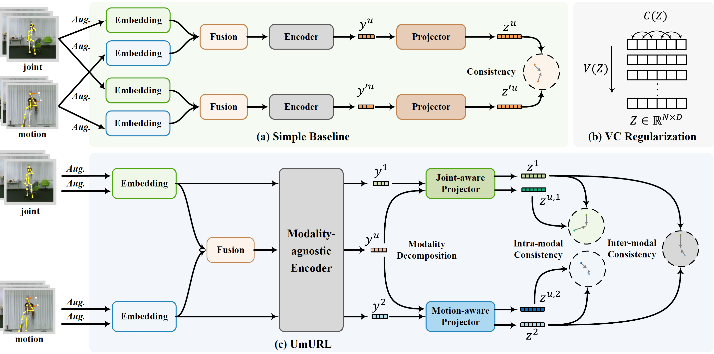
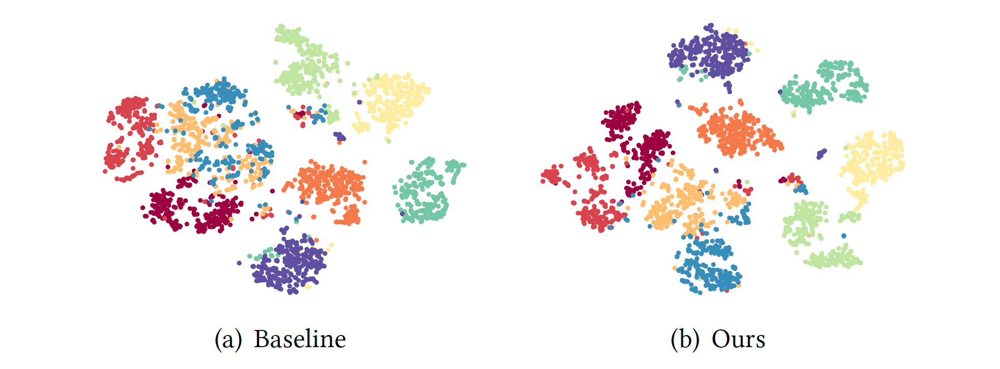

# Unified Multi-modal Unsupervised Representation Learning for Skeleton-based Action Understanding
**This is a repository containing the implementation of our ACM MM 2023 paper UmURL.**

**Paper Link**: [arXiv](https://arxiv.org/abs/2311.03106), [ACM DL](https://dl.acm.org/doi/10.1145/3581783.3612449)

<div align="center">
    
</div>

## Requirements
   
Use the following instructions to create the corresponding conda environment. 
```
conda create -n umurl python=3.9 anaconda
conda activate umurl
conda install pytorch==1.12.1 torchvision==0.13.1 torchaudio==0.12.1 -c pytorch
pip3 install tensorboard
```

## Data Preparation
- Download raw [NTU-RGB+D 60 and 120 skeleton data](https://github.com/shahroudy/NTURGB-D) and save to ./data folder.
```
- data/
  - nturgbd_raw/
    - nturgb+d_skeletons/
      ...
    - samples_with_missing_skeletons.txt
  - nturgbd_raw_120/
    - nturgb+d_skeletons/
      ...
    - samples_with_missing_skeletons.txt
```
- Preprocess data with `data_gen/ntu_gendata.py`.
```
cd data_gen
python ntu_gendata.py
```
## Pretraining and Evaluation
Our implementation is based on automatic mixed precision (***amp***) and  Distributed Data Parallel (***DDP***).
#### Unsupervised Pre-training
- Run the following script for pretraining. It will save the checkpoints to `./checkpoints/$TEST_NAME/`.
```
# ./script_pretrain.sh $TEST_NAME
# here is an example
./script_pretrain.sh ntu120_xsub
```
`$TEST_NAME` is the name of the folder where the checkpoints are saved in. The default setting is to pretrain with NTU-120 x-sub protocol. Please refer to the bash scripts for other pretraining configurations. 

#### Downstream Task Evaluation
- **Task1: Skeleton-based action recognition**. Train a linear classifier on pretrained encoder. The parameter meaning is the same as above. Multi-modal representations are utilized here.
```
# ./script_action_recognition.sh $TEST_NAME
./script_action_recognition.sh ntu120_xsub
```
It will automatically evaluate the checkpoint from the final epoch obtained from the aforementioned pre-training.

- **Task2: Skeleton-based action retrieval**. Apply a KNN classifier on on pretrained encoder. It's similar to action recognition, here is an example. 
```
./script_action_retrieval.sh ntu120_xsub
```


## Pretrained Models
We release several pre-trained models:
- [coming soon]  
Expected performance on skeleton-based action recognition and  skeleton-based action retrieval:  

|        Task        | NTU 60 x-sub (%) | NTU 60 x-view (%) | NTU 120 x-sub (%) | NTU 120 x-setup (%) |
| :----------------: | :--------------: | :---------------: | :---------------: | :-----------------: |
| action recognition |       84.2       |       90.9        |       75.2        |        76.3         |
|  action retrieval  |       72.0       |       88.9        |       59.5        |        62.2         |

## Visualization
[t-SNE](https://www.jmlr.org/papers/volume9/vandermaaten08a/vandermaaten08a.pdf) visualization of the learned multi-modal action representations obtained by (a) simple baseline and (b)
our proposed UmURL on NTU-60. 10 classes from the x-view testing set are randomly selected for visualization. Dots with the same color indicate actions belonging to the same class.

<div align="center">
    
</div>

## Citation
If you find this repository useful, please consider citing our paper:
```
@inproceedings{sun2023unified,
  title={Unified Multi-modal Unsupervised Representation Learning for Skeleton-based Action Understanding},
  author={Sun, Shengkai and Liu, Daizong and Dong, Jianfeng and Qu, Xiaoye and Gao, Junyu and Yang, Xun and Wang, Xun and Wang, Meng},
  booktitle={Proceedings of the 31st ACM International Conference on Multimedia},
  pages={2973--2984},
  year={2023}
}
```

## Acknowledgements 
This work was supported by the "Pioneer" and "Leading Goose" R&D Program of Zhejiang (No.2023C01212), Public Welfare Technology Research Project of Zhejiang Province (No. LGF21F020010), National Natural Science Foundation of China (No. 61976188, 62272435, and U22A2094), Young Elite Scientists Sponsorship Program by CAST (No. 2022QNRC001), the open research fund of The State Key Laboratory of Multimodal Artificial Intelligence Systems, and the Fundamental Research Funds for the Provincial Universities of Zhejiang.
